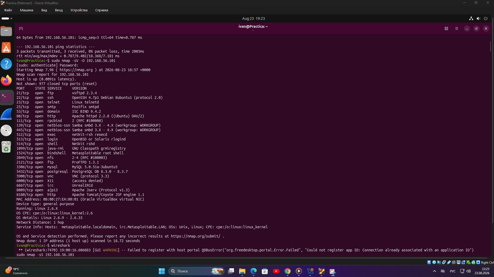
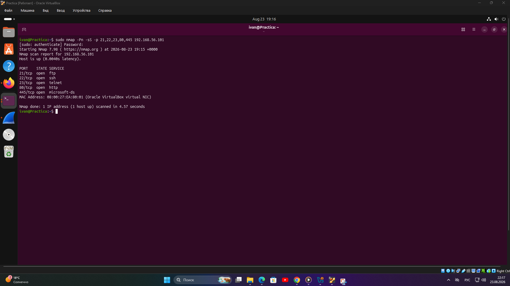
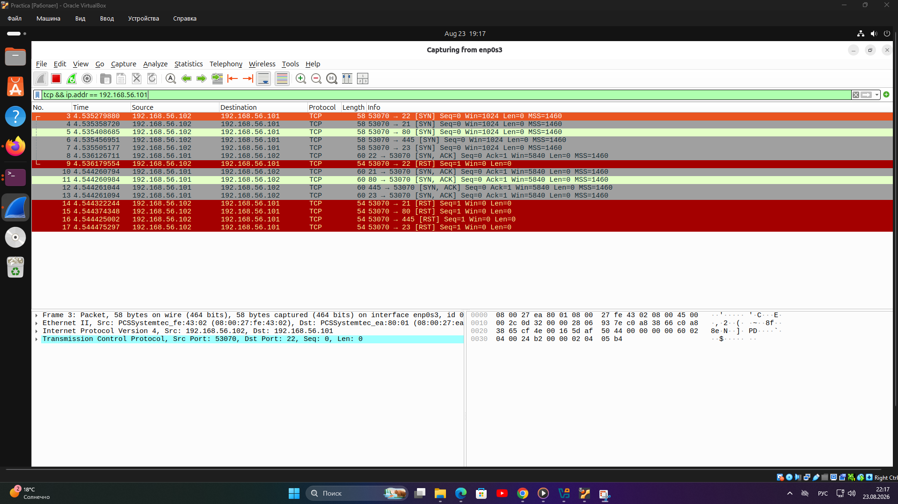
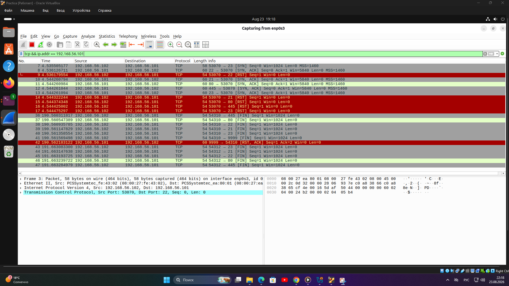
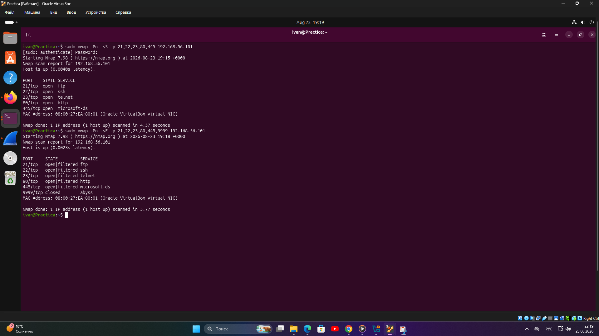
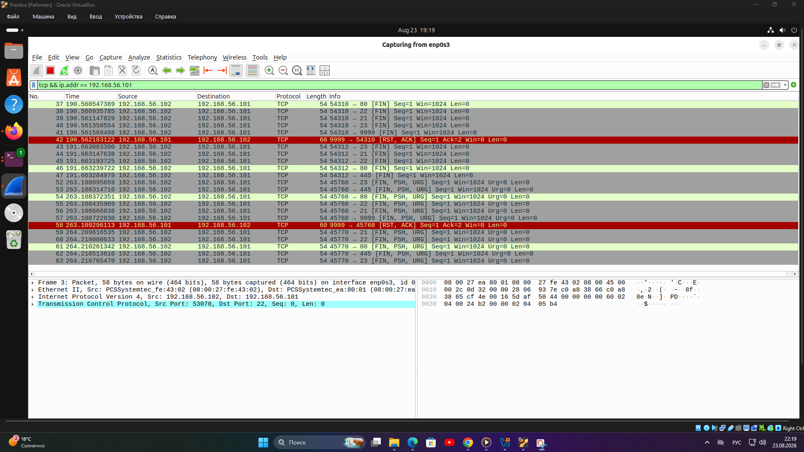
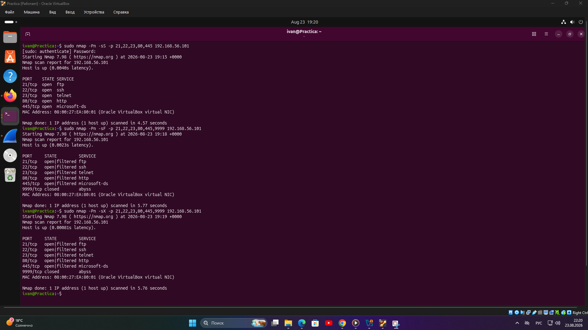
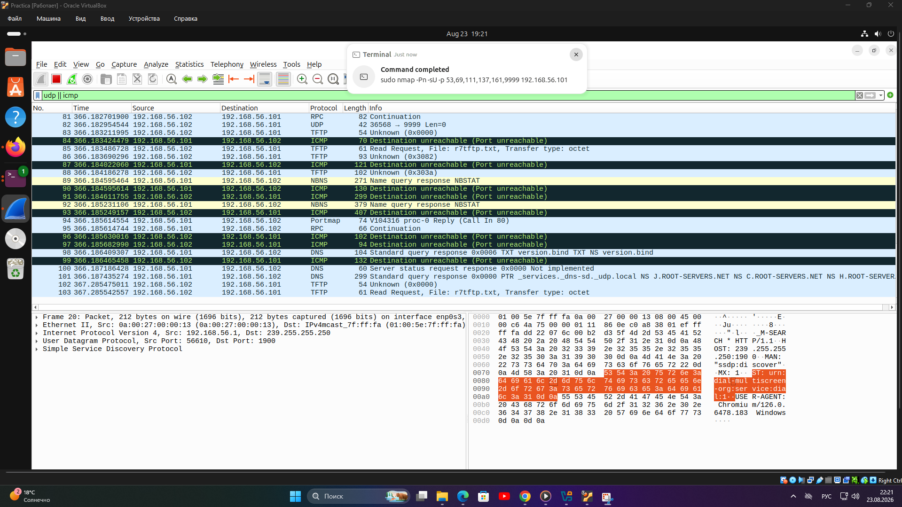
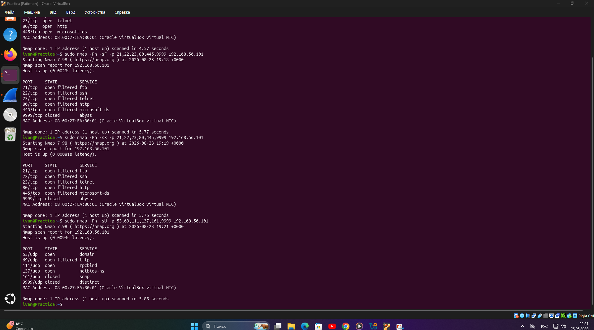

# Домашнее задание к занятию «Уязвимости и атаки на информационные системы»

**Выполнил:** Чернобровкин Иван

---

## Задание 1

### Условие

Установить виртуальную машину **Metasploitable**, выполнить её сканирование с помощью `nmap` и определить доступные сетевые службы.

Найти не менее трёх уязвимостей, которым подвержены обнаруженные сетевые службы, используя базу Exploit-DB.

Ответить на вопросы:

* какие сетевые службы разрешены;
* какие уязвимости были обнаружены.

### Решение

Для выполнения задания была запущена виртуальная машина **Metasploitable 2** с IP-адресом:

```text
192.168.56.101
```

Для определения открытых портов, сетевых служб и их версий было выполнено сканирование:

```bash
sudo nmap -sV -O 192.168.56.101
```

В результате сканирования были обнаружены следующие сетевые службы:

| Порт | Служба | Версия / описание |
| --- | --- | --- |
| 21/tcp | FTP | vsftpd 2.3.4 |
| 22/tcp | SSH | OpenSSH 4.7p1 |
| 23/tcp | Telnet | Linux telnetd |
| 25/tcp | SMTP | Postfix smtpd |
| 53/tcp | DNS | ISC BIND 9.4.2 |
| 80/tcp | HTTP | Apache httpd 2.2.8 |
| 111/tcp | RPC | rpcbind |
| 139/tcp | NetBIOS/SMB | Samba |
| 445/tcp | SMB | Samba |
| 512/tcp | exec | netkit-rsh rexecd |
| 513/tcp | login | rlogind |
| 514/tcp | shell | Netkit rshd |
| 1099/tcp | Java RMI | GNU Classpath grmiregistry |
| 1524/tcp | bindshell | Metasploitable root shell |
| 2049/tcp | NFS | NFS 2-4 |
| 2121/tcp | FTP | ProFTPD 1.3.1 |
| 3306/tcp | MySQL | MySQL 5.0.51a |
| 5432/tcp | PostgreSQL | PostgreSQL 8.3.x |
| 5900/tcp | VNC | VNC protocol 3.3 |
| 6000/tcp | X11 | X11 |
| 6667/tcp | IRC | UnrealIRCd |
| 8009/tcp | AJP13 | Apache JServ Protocol |
| 8180/tcp | HTTP | Apache Tomcat/Coyote |

По версиям обнаруженных служб были найдены следующие уязвимости:

1. **vsftpd 2.3.4 — Backdoor Command Execution**

   Уязвимость позволяет удалённо выполнять команды через встроенный backdoor.

   **CVE:** CVE-2011-2523  
   **Exploit-DB:** https://www.exploit-db.com/exploits/17491

2. **Samba 3.0.20 — Username Map Script Command Execution**

   Уязвимость позволяет удалённо выполнить команды через параметр `username map script`.

   **CVE:** CVE-2007-2447  
   **Exploit-DB:** https://www.exploit-db.com/exploits/16320

3. **UnrealIRCd 3.2.8.1 — Remote Command Execution**

   Уязвимая версия UnrealIRCd содержит backdoor, позволяющий удалённо выполнять команды на сервере.

   **CVE:** CVE-2010-2075  
   **Exploit-DB:** https://www.exploit-db.com/exploits/13853

### Скриншот



---

## Задание 2

### Условие

Провести сканирование Metasploitable в режимах:

* SYN;
* FIN;
* Xmas;
* UDP.

Записать сеансы сканирования с помощью **Wireshark**.

Ответить на вопросы:

* чем отличаются режимы сканирования с точки зрения сетевого трафика;
* как отвечает сервер.

### Решение

IP-адрес сканирующей машины:

```text
192.168.56.102
```

IP-адрес Metasploitable:

```text
192.168.56.101
```

Для анализа сетевого трафика использовался **Wireshark**.

---

### SYN Scan

Сканирование выполнено командой:

```bash
sudo nmap -Pn -sS -p 21,22,23,80,445 192.168.56.101
```

При SYN-сканировании Nmap отправляет TCP-пакет с флагом `SYN`.

Если порт открыт, сервер отвечает пакетом `SYN, ACK`, после чего Nmap отправляет `RST`, не устанавливая полноценное TCP-соединение.

Последовательность обмена:

```text
SYN → SYN, ACK → RST
```

### Скриншоты





---

### FIN Scan

Сканирование выполнено командой:

```bash
sudo nmap -Pn -sF -p 21,22,23,80,445,9999 192.168.56.101
```

При FIN-сканировании отправляются TCP-пакеты с установленным флагом `FIN`.

Открытые порты обычно не отвечают и определяются как:

```text
open|filtered
```

Для проверки использовался закрытый порт `9999`.

Сервер ответил на него пакетом:

```text
RST, ACK
```

Поэтому порт был определён как `closed`.

### Скриншоты





---

### Xmas Scan

Сканирование выполнено командой:

```bash
sudo nmap -Pn -sX -p 21,22,23,80,445,9999 192.168.56.101
```

При Xmas-сканировании одновременно устанавливаются TCP-флаги:

```text
FIN, PSH, URG
```

Открытые порты обычно не отвечают и определяются как:

```text
open|filtered
```

Закрытый порт `9999` отвечает пакетом `RST, ACK` и определяется как `closed`.

### Скриншоты





---

### UDP Scan

Сканирование выполнено командой:

```bash
sudo nmap -Pn -sU -p 53,69,111,137,161,9999 192.168.56.101
```

UDP не использует TCP-флаги и не устанавливает соединение.

В результате сканирования были получены следующие состояния:

```text
53/udp    open
69/udp    open|filtered
111/udp   open
137/udp   open
161/udp   closed
9999/udp  closed
```

Если UDP-порт закрыт, сервер может вернуть ICMP-сообщение:

```text
Destination unreachable (Port unreachable)
```

Такие ответы были зафиксированы в Wireshark.

### Скриншоты





---

### Вывод

Режимы сканирования отличаются типами отправляемых пакетов и реакцией сервера.

* **SYN Scan** — отправляется `SYN`. Открытый порт отвечает `SYN, ACK`, после чего Nmap отправляет `RST`.
* **FIN Scan** — отправляется пакет с флагом `FIN`. Открытые порты обычно не отвечают, закрытые отвечают `RST`.
* **Xmas Scan** — используются флаги `FIN`, `PSH`, `URG`. Открытые порты обычно не отвечают, закрытые возвращают `RST`.
* **UDP Scan** — отправляются UDP-пакеты. Закрытые порты могут отвечать ICMP-сообщением `Destination unreachable (Port unreachable)`.

Таким образом, анализ сетевого трафика в Wireshark позволяет увидеть различия между режимами сканирования и определить характер ответов сервера.
